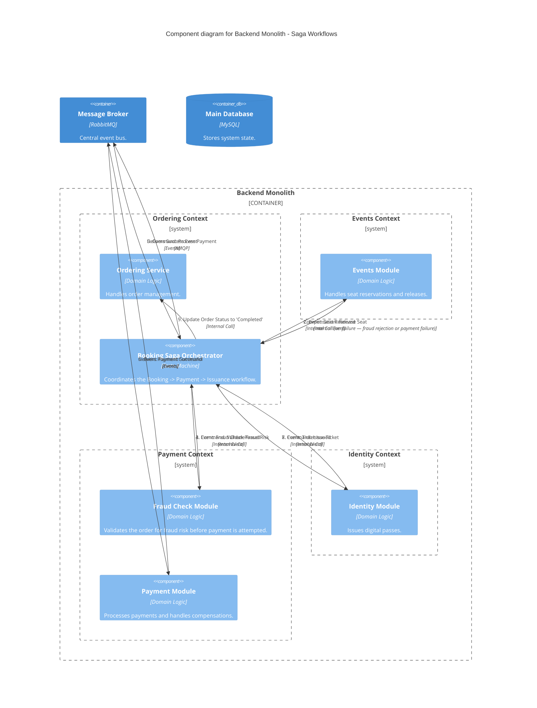

### Level 3: Component Diagram (Saga Orchestration)

**Note:** this diagram is scoped to the saga's own steps, so it omits the Notification Module —
unchanged since Session 2 and still present in the monolith (see the C2 diagram's
`Rel(api, notifications, ...)`) — since sending the confirmation alert isn't itself a saga step
with a compensation path.
