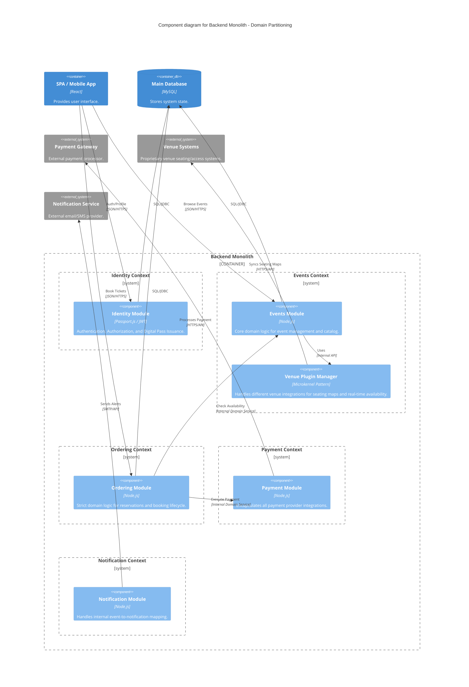

### Level 3: Component Diagram (Refined Backend Monolith)

```mermaid
C4Component
    title Component diagram for Backend Monolith - Domain Partitioning

    Container(spa, "SPA / Mobile App", "React", "Provides user interface.")
    ContainerDb(database, "Main Database", "MySQL", "Stores system state.")

    Container_Boundary(monolith, "Backend Monolith") {
        
        Boundary(identity_context, "Identity Context") {
            Component(identity, "Identity Module", "Passport.js / JWT", "Authentication, Authorization, and Digital Pass Issuance.")
        }

        Boundary(events_context, "Events Context") {
            Component(events_core, "Events Module", "Node.js", "Core domain logic for event management and catalog.")
            Component(venue_adapter, "Venue Plugin Manager", "Microkernel Pattern", "Handles different venue integrations for seating maps and real-time availability.")
        }

        Boundary(ordering_context, "Ordering Context") {
            Component(ordering, "Ordering Module", "Node.js", "Strict domain logic for reservations and booking lifecycle.")
        }

        Boundary(payment_context, "Payment Context") {
            Component(payment, "Payment Module", "Node.js", "Encapsulates all payment provider integrations.")
        }

        Boundary(notif_context, "Notification Context") {
            Component(notification, "Notification Module", "Node.js", "Handles internal event-to-notification mapping.")
        }
    }

    System_Ext(payment_ext, "Payment Gateway", "External payment processor.")
    System_Ext(venue_ext, "Venue Systems", "Proprietary venue seating/access systems.")
    System_Ext(notifications_ext, "Notification Service", "External email/SMS provider.")

    Rel(spa, identity, "Auth/Profile", "JSON/HTTPS")
    Rel(spa, events_core, "Browse Events", "JSON/HTTPS")
    Rel(spa, ordering, "Book Tickets", "JSON/HTTPS")

    Rel(ordering, events_core, "Check Availability", "Internal Domain Service")
    Rel(ordering, payment, "Execute Payment", "Internal Domain Service")
    
    Rel(events_core, venue_adapter, "Uses", "Internal API")
    Rel(venue_adapter, venue_ext, "Syncs Seating Maps", "HTTPS/API")
    
    Rel(payment, payment_ext, "Processes Payment", "HTTPS/API")
    Rel(notification, notifications_ext, "Sends Alerts", "SMTP/API")

    Rel(identity, database, "SQL/JDBC")
    Rel(events_core, database, "SQL/JDBC")
    Rel(ordering, database, "SQL/JDBC")
```
