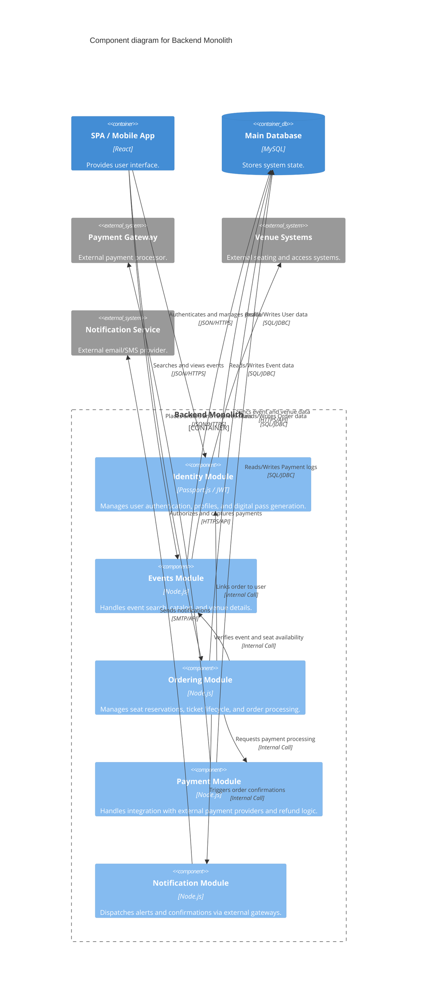

### Level 3: Component Diagram (Backend Monolith)

```mermaid
C4Component
    title Component diagram for Backend Monolith

    Container(spa, "SPA / Mobile App", "React", "Provides user interface.")
    ContainerDb(database, "Main Database", "MySQL", "Stores system state.")

    Container_Boundary(monolith, "Backend Monolith") {
        Component(identity, "Identity Module", "Passport.js / JWT", "Manages user authentication, profiles, and digital pass generation.")
        Component(events, "Events Module", "Node.js", "Handles event search, catalog, and venue details.")
        Component(ordering, "Ordering Module", "Node.js", "Manages seat reservations, ticket lifecycle, and order processing.")
        Component(payment, "Payment Module", "Node.js", "Handles integration with external payment providers and refund logic.")
        Component(notification, "Notification Module", "Node.js", "Dispatches alerts and confirmations via external gateways.")
    }

    System_Ext(payment_ext, "Payment Gateway", "External payment processor.")
    System_Ext(venue_ext, "Venue Systems", "External seating and access systems.")
    System_Ext(notifications_ext, "Notification Service", "External email/SMS provider.")

    Rel(spa, identity, "Authenticates and manages profile", "JSON/HTTPS")
    Rel(spa, events, "Searches and views events", "JSON/HTTPS")
    Rel(spa, ordering, "Places orders and reserves seats", "JSON/HTTPS")

    Rel(ordering, events, "Verifies event and seat availability", "Internal Call")
    Rel(ordering, payment, "Requests payment processing", "Internal Call")
    Rel(ordering, identity, "Links order to user", "Internal Call")
    
    Rel(payment, payment_ext, "Authorizes and captures payments", "HTTPS/API")
    Rel(ordering, notification, "Triggers order confirmations", "Internal Call")
    Rel(notification, notifications_ext, "Sends notifications", "SMTP/API")
    Rel(events, venue_ext, "Syncs event and venue data", "HTTPS/API")

    Rel(identity, database, "Reads/Writes User data", "SQL/JDBC")
    Rel(events, database, "Reads/Writes Event data", "SQL/JDBC")
    Rel(ordering, database, "Reads/Writes Order data", "SQL/JDBC")
    Rel(payment, database, "Reads/Writes Payment logs", "SQL/JDBC")
```
