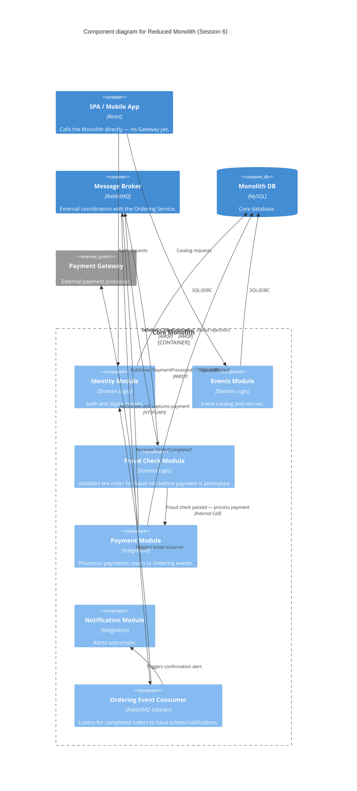

### Level 3: Component Diagram (Reduced Monolith)

**Note:** No API Gateway yet — the SPA calls this monolith's endpoints directly.

**Delta from Session 5 — the Fraud Check and Payment Modules now close the saga loop over the
broker:** the Session 5 in-process Booking Saga Orchestrator doesn't survive this session's
extraction (an orchestrator can't make synchronous in-process calls across two independently
deployable services). The Fraud Check Module still gates payment exactly as it did in Session 5 —
it reacts to `OrderCreated` first and only lets the Payment Module proceed on a pass, publishing
`PaymentFailed` itself on a fraud rejection. The Payment Module then publishes the payment outcome
back over `broker` — see `level-3-components-ordering-service.md` for the Ordering Service side of
this choreographed flow.
